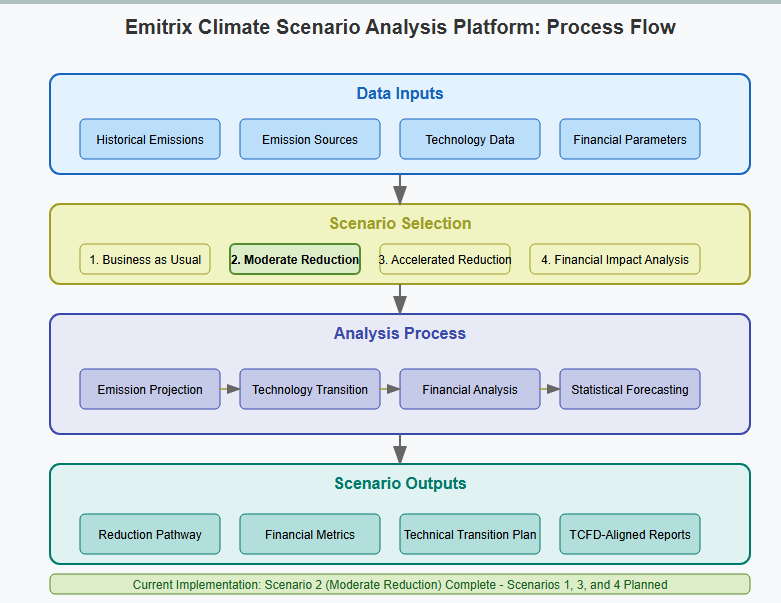
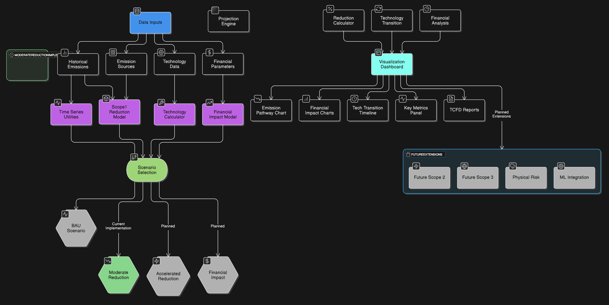

# Emitrix Climate Scenario Analysis Platform


A sophisticated platform for modeling and analyzing Scope 1 emissions reduction pathways, assessing financial impacts, and supporting strategic climate-related decision-making in alignment with TCFD, SBTi, and GHG Protocol standards.

## Table of Contents

- [Overview](#overview)
- [Features](#features)
- [Installation](#installation)
- [Usage](#usage)
- [Project Structure](#project-structure)
- [Implementation Status](#implementation-status)
- [Data Requirements](#data-requirements)
- [Development Roadmap](#development-roadmap)
- [Contributing](#contributing)
- [License](#license)

## Overview

The Emitrix Climate Scenario Analysis Platform provides organizations with AI-powered climate scenario modeling capabilities to assess climate-related risks and opportunities, support strategic decision-making, and meet regulatory reporting requirements. The platform focuses initially on Scope 1 emissions reduction pathways while being architected to expand to comprehensive scenario analysis covering all emission scopes, physical and transition risks, and financial impacts.

Current implementation focuses on the Moderate Reduction scenario (Scenario 2), achieving a 30% emissions reduction by 2030 through a balanced technology implementation approach.

## Features

- **Scope 1 Emissions Reduction Modeling**: Model different reduction pathways with detailed source-level analysis
- **Technology Transition Simulation**: Evaluate the impact of different technology mixes and implementation timelines
- **Financial Impact Analysis**: Calculate carbon pricing impacts, implementation costs, ROI, and payback periods
- **Interactive Visualization**: Explore results through an intuitive dashboard built with Streamlit
- **Statistical Forecasting**: Generate emissions trends using multiple statistical models
- **TCFD-Aligned Reporting**: Generate outputs aligned with Task Force on Climate-related Financial Disclosures (TCFD) recommendations

## Installation

### Prerequisites

- Python 3.8+
- pip (Python package installer)

### Installation Steps

1. Clone the repository:
   ```bash
   git clone https://github.com/enigma-kun/emitrix-climate-scenario.git
   cd emitrix-climate-scenario
   ```

2. Create a virtual environment (recommended):
   ```bash
   python -m venv venv
   source venv/bin/activate  # On Windows: venv\Scripts\activate
   ```

3. Install dependencies:
   ```bash
   pip install -r requirements.txt
   ```

## Usage



### Running the Application

Launch the Streamlit interface:
```bash
streamlit run app.py
```

The application will be available in your browser at `http://localhost:8501`.

### Using the Dashboard

1. **Configure Scenario Parameters**:
   - Set your reduction target (e.g., 30% by 2030)
   - Adjust carbon price parameters (starting price and annual increase)
   - Define technology implementation mix (electric boilers, electric vehicles, etc.)
   - Set financial parameters like discount rate

2. **Run the Model**:
   - Click "Run Model" to execute the scenario analysis

3. **Explore Results**:
   - View emissions reduction pathway
   - Analyze financial impacts
   - Examine technology transition timeline
   - Review key performance metrics

### Example Scenario: Moderate Reduction (30% by 2030)

The default "Moderate Reduction" scenario aims to achieve a 30% reduction in Scope 1 emissions by 2030 through:

- Gradual technology implementation starting in 2026
- Fuel switching for 50% of sources by 2030
- Equipment efficiency upgrades with 5-year payback periods
- Carbon price starting at $30/tCO2e with 5% annual increase

## Project Structure

```
emitrix/
├── data/
│   ├── __init__.py
│   ├── historical_emissions.py   # Sample data generation
│   ├── emission_factors.py       # Reference emission factors
│   └── technology_data.py        # Technology implementation data
│
├── models/
│   ├── __init__.py
│   ├── scope1_reduction_model.py # Core reduction model
│   ├── technology_calculator.py  # Technology transition calculations
│   ├── financial_model.py        # Financial impact calculations
│   └── time_series_utils.py      # Statistical modeling utilities
│
├── tests/
│   ├── __init__.py
│   ├── test_models.py            # Unit tests for models
│   └── test_data.py              # Data validation tests
│
├── app.py                        # Streamlit application
├── requirements.txt              # Project dependencies
└── README.md                     # This file
```

## Implementation Status

The current implementation focuses on Scenario 2 (Moderate Reduction), with the following components:

| Component | Status | Description |
|-----------|--------|-------------|
| Emissions Modeling Engine | ✅ Complete | Core calculation engine for projecting emissions and modeling reductions |
| Technology Transition Calculator | ✅ Complete | Models implementation of different technologies and their emission impacts |
| Financial Analysis Module | ✅ Complete | Calculates NPV, ROI, payback periods, and marginal abatement costs |
| Statistical Forecasting | ✅ Complete | Provides trend analysis and baseline projections |
| Interactive Dashboard | ✅ Complete | Streamlit interface with parameter controls and visualization |
| Data Import/Export | 🔄 Planned | Will allow importing real organizational data |
| Extended Time Horizon (2050) | 🔄 Planned | Will extend modeling to 2050 for SBTi compliance |
| Additional Scenarios | 🔄 Planned | BAU, Accelerated Reduction, and Financial Impact Analysis scenarios |

## Data Requirements

The platform currently operates with sample generated data. For real-world implementation, organizations will need to provide:

### Required Data Types
- Historical Scope 1 emissions data (3-5 years, monthly or quarterly)
- Emission sources inventory (stationary, mobile, fugitive)
- Technology implementation data (costs, efficiencies, timelines)
- Financial parameters (discount rate, capital constraints)

### Data Format Options
- CSV file upload (preferred format)
- Excel files with standardized sheets
- API integration with existing systems
- Manual entry for smaller organizations

See the [Data Requirements Guide](docs/data-requirements.md) for detailed specifications on data formats and quality requirements.

## Development Roadmap

### Phase 2: Extended Scenario Analysis (Q2 2025)
- Implement Scenario 1 (BAU) with regulatory risk assessment
- Add Scenario 3 (Accelerated Reduction - 50% by 2030)
- Extend modeling capability to 2050 for SBTi alignment
- Add TCFD-aligned report generation

### Phase 3: Financial Enhancement (Q3 2025)
- Implement Scenario 4 (Financial Impact Analysis)
- Add interactive marginal abatement cost curve visualization
- Enhance tax benefit calculation
- Implement capital allocation optimization

### Phase 4: Scope Expansion (Q4 2025)
- Add Scope 2 emissions modeling
- Implement Scope 3 emissions screening
- Add physical risk assessment capabilities
- Develop value chain modeling

### Phase 5: Advanced Analytics (Q1 2026)
- Implement ML-powered optimization for reduction pathways
- Add uncertainty analysis with Monte Carlo simulations
- Create automated anomaly detection for emissions data
- Add industry benchmarking capabilities

See the [Development Checklist](docs/development-checklist.md) for a comprehensive list of planned features and enhancements.

## Standards Alignment

The platform aligns with key climate-related frameworks:

### Task Force on Climate-related Financial Disclosures (TCFD)
- Climate scenario analysis (✅ Scope 1 implemented)
- Financial impact assessment (✅ Implemented)
- Transition risk evaluation (✅ Implemented for technology transition)

### Science-Based Targets Initiative (SBTi)
- 1.5°C-aligned reduction pathway (✅ Implemented for 2030)
- Near-term targets (2030) (✅ Implemented)
- Long-term targets (2050) (🔄 Planned)
- Net-zero pathway (🔄 Planned)

### GHG Protocol
- Scope 1 direct emissions (✅ Implemented)
- Source-level tracking (✅ Implemented)
- Organizational boundaries (✅ Implemented)
- Base year emissions (✅ Implemented)

## Contributing

We welcome contributions to the Emitrix Climate Scenario Analysis Platform. Please see our [contributing guidelines](CONTRIBUTING.md) for details.

## License

This project is licensed under the MIT License - see the [LICENSE](LICENSE) file for details.

## Acknowledgements

- Task Force on Climate-related Financial Disclosures (TCFD)
- The Greenhouse Gas Protocol
- Science Based Targets initiative (SBTi)